# ipsnipe ⚡

**Advanced Machine Reconnaissance Framework v2.2 - HTB Optimized**

A user-friendly CLI tool for automated penetration testing and reconnaissance. Integrates multiple security tools with intelligent scanning and beautiful output formatting. **Now optimized for Hack The Box with advanced DNS enumeration, enhanced web discovery, and research-backed wordlists.**

```
 ___  ________  ________  ________   ___  ________  _______      
|\  \|\   __  \|\   ____\|\   ___  \|\  \|\   __  \|\  ___ \     
\ \  \ \  \|\  \ \  \___|\ \  \\ \  \ \  \ \  \|\  \ \   __/|    
 \ \  \ \   ____\ \_____  \ \  \\ \  \ \  \ \   ____\ \  \_|/__  
  \ \  \ \  \___|\|____|\  \ \  \\ \  \ \  \ \  \___|\ \  \_|\ \ 
   \ \__\ \__\     ____\_\  \ \__\\ \__\ \__\ \__\    \ \_______\
    \|__|\|__|    |\_________\|__| \|__|\|__|\|__|     \|_______|
                  \|_________|                                   

    ⚡ Advanced Machine Reconnaissance Framework ⚡
    ═══════════════════════════════════════════════
```
> ⚠️ **Warning: Beta Software**  
> This tool is under active development. While functional, you may encounter bugs or incomplete features.  
> Please report issues on GitHub to help improve the project.

> 💡 **Tip:** For the best experience, use Kali Linux or Ubuntu with Python 3.8+.

> 🔧 **Development Status:**  
> - Core functionality: ✅ Complete  
> - Enhanced DNS: 🟡 In Progress  
> - Web Enumeration: 🟡 In Progress  
> - Documentation: 🟡 In Progress  
> - Testing: 🟡 In Progress  
> - Reporting: 🟡 In Progress

> 🐛 **Known Issues:**  
> - Some DNS enumeration features may be incomplete
> - Web discovery may miss certain edge cases
> - Documentation may be outdated
> - Performance optimizations pending
> - Report generation may be incomplete or contain errors

> 📝 **Contributing:**  
> Feel free to submit issues and pull requests to help improve the project!


## ✨ Features

### 🎯 **Automated Reconnaissance**
- **Streamlined Tool Integration** - Nmap with automatic web detection, Feroxbuster, FFUF, and theHarvester
- **Intelligent Automation** - Web service detection and technology fingerprinting run automatically
- **Sequential Processing** - Optimized scan order: port discovery → automatic web detection → targeted enumeration
- **Progress Tracking** - Real-time status updates with execution times and success/failure indicators

### 🌐 **Intelligent Web Service Detection**
- **Automatic Integration** - Web service detection runs automatically with every nmap scan
- **Standalone Web Detection** - Web tools auto-discover ports if run without nmap first
- **Multi-Method Detection** - Combines nmap parsing + direct HTTP/HTTPS testing for maximum coverage
- **Intelligent Fallback** - Multiple detection methods ensure web services aren't missed
- **HTB-Optimized Logic** - Handles edge cases like "tcpwrapped" services on port 80
- **Protocol Detection** - Determines HTTP vs HTTPS and uses appropriate scanning parameters
- **Seamless Workflow** - No manual intervention needed for web service discovery

### 🔐 **Enhanced/Standard Scanning Modes**
- **Privilege Detection** - Automatically detects sudo access and recommends appropriate mode
- **Enhanced Mode (sudo)**: SYN scans (faster/stealthier), UDP scanning, OS detection, advanced Nmap scripts
- **Standard Mode (no-sudo)**: TCP connect scans, service detection, all web enumeration tools
- **Smart Fallback** - Gracefully handles permission issues and adapts scan techniques
- **Mode Selection** - Force modes via CLI flags (`--enhanced` or `--standard`)

### 🔌 **Flexible Port Configuration**
- **Multiple Formats** - Single ports (`80`), ranges (`1-1000`), lists (`80,443,8080`)
- **Smart Defaults** - HTB-optimized port ranges for quick reconnaissance
- **Custom Targeting** - User-defined port ranges for specific scenarios
- **All-Port Scanning** - Full 65535 port enumeration when needed
- **Service-Specific** - Different port handling for TCP vs UDP scans

### 📊 **Enhanced Output & Reporting**
- **Emoji Highlighting** - Visual indicators for findings (🔓 open ports, 📁 directories, ⚠️ vulnerabilities)
- **Organized Structure** - Timestamped directories with logical file naming
- **Comprehensive Reports** - Detailed SUMMARY_REPORT.md with analysis guidance
- **Execution Metrics** - Timing, file sizes, success rates, and performance data
- **HTB-Specific Tips** - Tailored advice for Hack The Box machine enumeration
- **Finding Categories** - Automatically categorizes and prioritizes discovered information

### ⏸️ **Interactive Scan Control**
- **Skip Individual Scans** - Press 's' + Enter to skip current scan without losing progress
- **Quit All Scans** - Press 'q' + Enter to terminate remaining scans gracefully
- **Progress Tracking** - Real-time scan progress with x/y scan completion counter
- **Graceful Termination** - Proper cleanup of running processes when interrupted
- **Resume-Friendly** - Completed scans are saved even if session is interrupted early

### ⚙️ **Advanced Configuration**
- **TOML Configuration** - Centralized settings in `config.toml` with intelligent defaults
- **Tool Customization** - Adjust timeouts, threads, wordlists, and scan parameters
- **Wordlist Management** - HTB-optimized wordlists with automatic fallbacks
- **Output Control** - Configurable formatting, line length limits, and content highlighting
- **Timeout Management** - Configurable scan timeouts with tool-specific limits

### 🧠 **Intelligent Scanning Logic**
- **Dependency Detection** - Checks for required tools and provides installation guidance
- **Error Handling** - Graceful failure recovery with detailed error reporting
- **Resource Management** - Prevents resource exhaustion with configurable limits
- **Scan Optimization** - Skips redundant scans and focuses on promising targets
- **Adaptive Behavior** - Adjusts scanning approach based on discovered services

### 🛡️ **Security & Ethics**
- **Built-in Disclaimer** - Comprehensive ethical use agreement before scanning
- **Legal Compliance** - Clear guidelines for authorized testing only
- **Attribution Requirements** - Proper crediting for tool usage and modifications
- **Responsible Disclosure** - Guidance on handling discovered vulnerabilities
- **Best Practices** - Educational content on ethical penetration testing

### 🎮 **User Experience**
- **Interactive Interface** - Intuitive menu system with clear options
- **Colorized Output** - Terminal colors for better readability and status indication
- **Demo Mode** - Test interface without running actual scans
- **Verbose Logging** - Detailed debug information when needed
- **Cross-Platform** - Supports Linux, macOS, and Windows (via WSL2)
- **HTB Optimization** - Specifically designed for Hack The Box machine reconnaissance

## 🎯 HTB-Optimized Features (NEW v2.2)

### 🚀 **Advanced DNS Enumeration**
- **Certificate Transparency Discovery** - Searches crt.sh for subdomain discovery via SSL certificates
- **HTB-Optimized Subdomain Brute Force** - 45+ common HTB subdomains (admin, api, dev, test, staging, portal, backup, secret, flag, etc.)
- **Zone Transfer Attempts (AXFR)** - Automatic AXFR attempts against discovered nameservers
- **Reverse DNS Analysis** - Tests nearby IP ranges (±10 IPs) for reverse DNS patterns
- **Advanced Tools Integration** - Automatic use of subfinder, amass, and dnsrecon when available
- **Comprehensive DNS Records** - A, AAAA, CNAME, MX, TXT, NS, SOA, SRV, PTR enumeration

### 🌐 **Enhanced Web Discovery**
- **Multi-Tool Directory Enumeration** - Combines gobuster with custom HTB path testing
- **JavaScript Endpoint Analysis** - Extracts API endpoints and secrets from JavaScript files
- **HTB-Specific File Extensions** - 25+ file types (php, html, asp, jsp, txt, zip, bak, old, backup, conf, config, sql, etc.)
- **HTB-Specific Paths** - 45+ common HTB paths (admin, login, panel, api, backup, config, secret, flag, robots.txt, .env, etc.)
- **Sensitive File Discovery** - Automated testing for 25+ sensitive files common in HTB
- **Parameter Discovery** - Tests common HTB parameters (id, user, debug, cmd, include, etc.)
- **Technology Fingerprinting** - Enhanced detection using WhatWeb + header analysis + response fingerprinting

### 📚 **Research-Backed HTB Wordlists**
- **HTB Champion Wordlist** - `/usr/share/seclists/Discovery/Web-Content/directory-list-2.3-medium.txt` (most successful in HTB community)
- **Fast HTB Recon** - `/usr/share/seclists/Discovery/Web-Content/common.txt` (2-3 minute scans)
- **HTB Balanced Approach** - `/usr/share/seclists/Discovery/Web-Content/raft-medium-directories.txt` (different ordering strategy)
- **HTB Comprehensive** - `/usr/share/seclists/Discovery/Web-Content/directory-list-2.3-big.txt` (maximum coverage)
- **Specialized Wordlists** - API endpoints, parameters, backup files, and subdomain lists
- **Automatic SecLists Installation** - Essential wordlists installed during setup

### ⚙️ **HTB-Optimized Configuration**
- **Research-Based Defaults** - All settings optimized based on HTB community research and testing
- **Enhanced Scanner Configuration** - Advanced DNS and web scanners with HTB-specific settings
- **Configurable via config.toml** - All HTB optimizations fully configurable in single file
- **Fallback Compatibility** - Graceful degradation when advanced tools aren't available

## 🔄 Enhanced Reconnaissance Flow

**Complete automated workflow with DNS enumeration and domain discovery:**

```mermaid
graph TD
    A["🚀 nmap_quick scan"] --> B["🔍 Port discovery"]
    B --> C["🌐 Web port detection"]
    C --> D["📡 Enhanced web port testing"]
    D --> E["🚀 Immediate whatweb domain discovery"]
    
    E --> F["🎯 Domain discovery results"]
    F --> G["🛡️ Backup /etc/hosts"]
    G --> H["📝 Add domains to /etc/hosts"]
    H --> I["✅ Verify domain resolution"]
    I --> J["🌟 Enhanced nmap with domain"]
    
    J --> K["🔍 Step 6: Comprehensive DNS enumeration"]
    
    K --> L["🔄 Zone transfer attempts (AXFR)"]
    K --> M["📊 DNS record enumeration"]
    K --> N["🔨 Subdomain brute force"]
    K --> O["🃏 Wildcard detection"]
    K --> P["🔄 Reverse DNS lookup"]
    
    L --> Q["📍 Extract subdomains from zone transfers"]
    M --> R["🌐 Discover nameservers & records"]
    N --> S["✅ Find common subdomains"]
    O --> T["⚠️ Detect wildcard responses"]
    P --> U["📍 PTR record discovery"]
    
    Q --> V["📝 Add all new subdomains to /etc/hosts"]
    R --> V
    S --> V
    T --> V
    U --> V
    
    V --> W["🔧 Configure wordlist manager"]
    W --> X["🎯 Target-specific wordlists with cewl"]
    X --> Y["🦀 Enhanced web enumeration"]
    Y --> Z["🎉 Comprehensive reconnaissance complete"]
    
    style A fill:#e1f5fe
    style K fill:#f3e5f5
    style V fill:#e8f5e8
    style Z fill:#fff3e0
```



**Key Features:**
- 🌐 **Automatic Domain Discovery** - WhatWeb captures HTTP headers and discovers *.htb domains
- 🔍 **Comprehensive DNS Enumeration** - Zone transfers, subdomain brute force, wildcard detection
- 📝 **Auto /etc/hosts Management** - All discovered domains automatically added for resolution
- 🎯 **Target-Specific Wordlists** - CeWL generates custom wordlists from discovered domains
- 🔄 **Complete Integration** - Everything flows seamlessly without manual intervention

## 🛠️ Supported Tools

| Tool | Purpose | Enhanced Mode |
|------|---------|---------------|
| **Nmap** | Port/Service scanning + Web Detection | SYN scans, OS detection, UDP |
| **Feroxbuster** | Directory enumeration (medium wordlist) | - |
| **FFUF** | Subdomain enumeration (multiple wordlists) | - |
| **Parameter Discovery & LFI** | Arjun + ParamSpider + WFUZZ + LFI Suite | Comprehensive parameter fuzzing and LFI testing |
| **CMS Detection & Enumeration** | CMSeek + HTTP-Enum + CMS-specific tools | Complete CMS identification and security analysis |
| **DNS Enumeration** | Comprehensive dig-based DNS enumeration | Zone transfers (AXFR), subdomain brute force, wildcard detection |
| **🚀 Advanced DNS Enumeration (NEW)** | **HTB-optimized comprehensive DNS discovery** | **Certificate transparency, advanced tools (subfinder, amass, dnsrecon)** |
| **🌐 Enhanced Web Discovery (NEW)** | **HTB-optimized multi-tool web enumeration** | **JavaScript analysis, gobuster integration, HTB-specific paths/extensions** |
| **WhatWeb** | Technology detection (automatic) | - |
| **theHarvester** | Information gathering | - |
| **CeWL** | Custom wordlist generation (automatic) | Target-specific wordlists from discovered domains |
| **🎯 Gobuster (NEW)** | **Fast directory enumeration** | **HTB-optimized with SecLists wordlists** |
| **📡 Subfinder (NEW)** | **Advanced subdomain enumeration** | **Certificate transparency and passive discovery** |
| **🔍 Amass (NEW)** | **Advanced OSINT enumeration** | **Comprehensive subdomain and asset discovery** |
| **🗂️ DNSRecon (NEW)** | **Advanced DNS reconnaissance** | **Zone transfers, brute force, record enumeration** |


## 🚀 Quick Start

```bash
# 1. Clone and install
git clone https://github.com/hckerhub/ipsnipe.git
cd ipsnipe
chmod +x install.sh && ./install.sh

# 2. Run ipsnipe
python3 ipsnipe.py

# 3. Optional: Force enhanced/standard mode
python3 ipsnipe.py --enhanced   # Force sudo mode
python3 ipsnipe.py --standard   # Force no-sudo mode
```

## 📋 Requirements

- **Python 3.8+**
- **Linux/macOS** (Windows via WSL2)
- **Internet connection** for tool installation

**Supported Systems:**
- ✅ Kali Linux (recommended)
- ✅ Ubuntu/Debian  
- ✅ macOS (via Homebrew)
- ✅ Arch Linux
- ⚠️ Windows (WSL2 only)

## 📖 Usage

### Interactive Mode
```bash
python3 ipsnipe.py
```

1. **Enter target IP** (e.g., `10.10.10.123`)
2. **Choose scan mode** (Enhanced with sudo or Standard)
3. **Select tools** (individual, all, web, nmap, or basic)
4. **Configure ports** for Nmap (single, range, or comma-separated)
5. **Start reconnaissance**

### Scan Selection Options
```bash
🚀 all     # Run all available modules (1-11)
            # Individual module selection (1,2,3,4,5,6,7,8,9,10,11)
            # 8) DNS Enumeration - Comprehensive DNS enumeration
            # 9) 🚀 Advanced DNS Enumeration - HTB-optimized (certificate transparency, zone transfers, advanced tools)
            # 10) 🌐 Enhanced Web Discovery - HTB-optimized (JavaScript analysis, multi-tool enumeration)
            # 11) theHarvester - Information gathering
```

### Port Range Examples
```bash
80                    # Single port
1-1000               # Port range  
80,443,8080          # Specific ports
1-65535              # All ports
default              # Use config defaults
```

### Interactive Scan Control
During scan execution, you can control the process:

```bash
# While scans are running:
s + Enter             # Skip current scan, continue with next
q + Enter             # Quit all remaining scans gracefully
Ctrl+C                # Emergency termination (immediate stop)
```

**Benefits:**
- **No Progress Loss** - Completed scans are preserved even if you skip later ones
- **Time Saving** - Skip slow scans if you find what you need
- **Flexible Workflow** - Adapt scanning strategy based on initial results

### Web Service Detection
ipsnipe uses multiple intelligent methods to ensure web services are never missed:

```bash
# Method 1: Enhanced nmap parsing
✅ Detects "tcpwrapped" services on port 80 as web services
✅ Handles various nmap output formats

# Method 2: Standalone web detection
✅ Direct HTTP/HTTPS testing using curl
✅ Works independently of nmap results  
✅ Perfect for HTB machines

# Method 3: Auto-discovery for web-only scans
✅ Web tools auto-discover ports when run without nmap
✅ Tests common web ports (80, 443, 8080, 8443, etc.)
✅ Includes domain discovery when services found

# Method 4: Automatic fallback
✅ Tests common web ports if nmap parsing fails
✅ Seamlessly integrates detected services
```

**Perfect for HTB:** Web detection runs automatically OR when you run web-only scans!

### Enhanced vs Standard Mode

| Feature | Enhanced (sudo) | Standard |
|---------|----------------|----------|
| TCP Scans | SYN (stealth) | Connect |
| UDP Scans | ✅ Available | ❌ Skipped |
| OS Detection | ✅ Available | ❌ Disabled |
| Speed | Faster | Slower |
| Privileges | Requires sudo | User-level |

## 📁 Output

Creates organized directories with detailed reports:

```
ipsnipe_10.10.10.123_20241201_143022/
├── SUMMARY_REPORT.md      # Overview with analysis tips
├── nmap_quick.txt         # Port scan results  
├── web_detection.txt      # Web service detection results

└── whatweb.txt           # Technology stack
```

## ⚙️ Configuration

Edit `config.toml` to customize:
- Scan timeouts (default: 5 minutes)
- Wordlist paths
- Tool-specific settings
- Output formatting

## 🐛 Troubleshooting

### Progress Display Issues

If you experience issues with the progress indicator creating new lines or displaying incorrectly:

```bash
# Force simple progress mode
export IPSNIPE_SIMPLE_PROGRESS=1
python3 ipsnipe.py
```

This will use a simpler progress indicator that's more compatible with different terminal types.

### Common Issues
```bash
# Tools not found
./install.sh

# Permission errors  
sudo python3 ipsnipe.py

# Python version issues
python3 --version  # Requires 3.8+

# WSL2 networking
sudo service networking restart
```

### Tool Installation
```bash
# Ubuntu/Debian
sudo apt install nmap ffuf ruby curl
sudo gem install whatweb

# macOS
brew install nmap feroxbuster ffuf ruby curl
gem install whatweb

# Note: curl is typically pre-installed on most systems
```

## ⚖️ Legal & Ethical Use

**⚠️ AUTHORIZED USE ONLY**

This tool is for:
- ✅ Authorized penetration testing
- ✅ Your own systems/lab environments  
- ✅ CTF competitions and educational use
- ✅ Bug bounty programs (within scope)

**NOT for:**
- ❌ Unauthorized scanning
- ❌ Systems you don't own/have permission to test
- ❌ Any illegal activities

By using ipsnipe, you agree to use it legally and ethically. The author is not responsible for misuse.

## 👨‍💻 Author & Support

**Created by hckerhub**

- 🌐 **Website:** [hackerhub.me](https://hackerhub.me)
- 🐦 **X:** [@hckerhub](https://x.com/hckerhub)  
- 💻 **GitHub:** [github.com/hckerhub](https://github.com/hckerhub)
- ☕ **Support:** [buymeacoffee.com/hckerhub](https://buymeacoffee.com/hckerhub)

## 📄 License

MIT License - See [LICENSE](LICENSE) file for details.

---

**Happy ethical hacking! 🎯** 